# maximo-pm-due-dates-quiz

## Table of Contents

- [Introduction](#introduction)
- [Design](#design)
    - [GUI Prototype](#gui-prototype)
    - [Functional Requirements](#functional-requirements)
    - [Non-Functional Requirements](#non-functional-requirements)
    - [Tech Stack](#tech-stack)
    - [Code Design](#code-design)
- [Development](#development)
- [Testing](#testing)
    - [Testing Strategy and Methodology](#testing-strategy-and-methodology)
    - [Unit Testing Outcomes](#unit-testing-outcomes)
    - [Continuous Integration](#continuous-integration)
    - [Manual Testing Outcomes](#manual-testing-outcomes)
- [Documentation](#documentation)
    - [User Documentation](#user-documentation)
    - [Technical Documentation](#technical-documentation)
- [Evaluation](#evaluation)

## Introduction

**MACS EU** is a system integration consultancy that helps implement asset management systems, including **IBM Maximo**.

My current role inside MACS EU is as a **data and analytics consultant**. Working here gave me a deeper professional perspective and highlighted a recurring issue with client data in IBM Maximo: mismanagement. This mostly stems from a lack of understanding. That's why I chose this section to review: it has the most depth, bringing together one major Maximo function and three key database tables: Asset, PM and Job Plan.

The mismanagement of data can seem small, but if PMs are not attended to on time, even if due to a small data error, this can make companies non-compliant with their SLAs and lead to fines or even cause damage onsite if an asset isn't checked.

To address this knowledge gap, this Tkinter application lets users learn how Preventive Maintenance work orders are generated and how assets, PMs, and job plans relate. It provides the user with synthetic asset, PM, and Job plan data and asks them to provide the next PM due date and the next job plan frequency, reinforcing the knowledge with repetition through multiple generated questions. 

This quiz is aimed at users who will interact with Preventive Maintenance data through the front end (clients or internal users) or through database and MIF loading. With higher training and knowledge among both our clients and the individuals implementing the data design, MACS EU can support a more logical workflow and communicate requirements for the Preventive Maintenance application more clearly to clients.

## Design
### GUI Prototype

The GUI and user journey were generated in Figma as a clickable prototype. I kept it as a Lo-Fi, greyscale sketch rather than a full deployment view, to allow a more deliberate design style to be outlined later.

Figma prototype: [Maximo PM Due Date Quiz - AE2 - Design](https://www.figma.com/community/file/1679898121843546210)

---

#### Figma GUI Walkthrough of User Journey:

##### Landing Frame
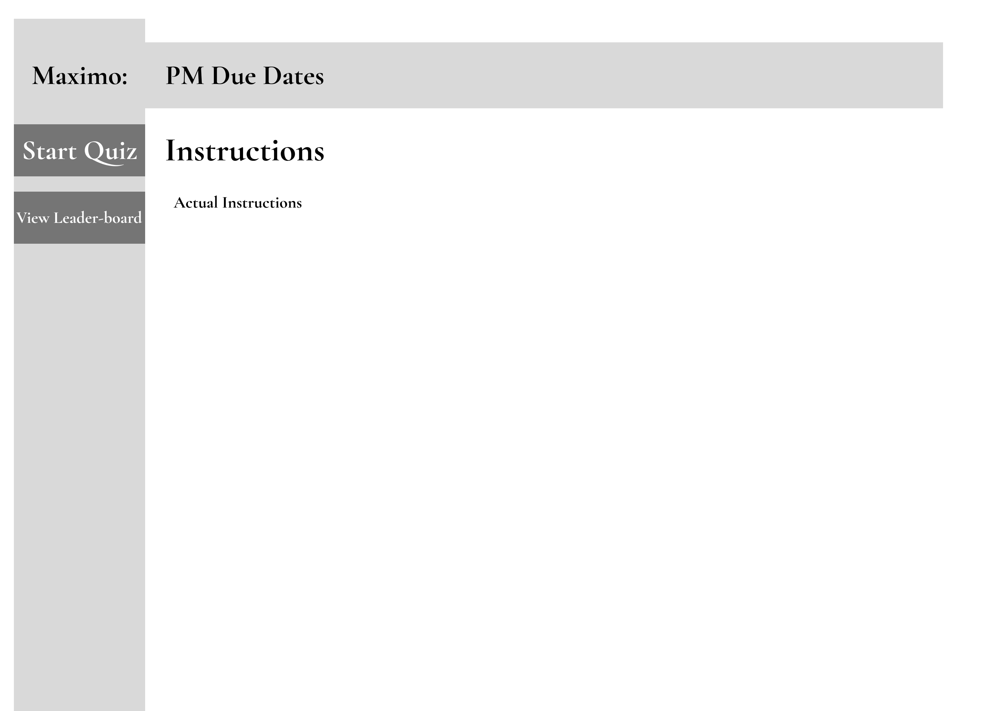

**Figure 1**: Landing frame of the Maximo PM Due Date Quiz Figma prototype.

The landing frame (Figure 1) holds the instructions to the quiz and provides the user with two directions: one to start a new quiz, taking them to the User Details frame (Figure 2), or the other to view the leaderboard (Figure 11).

##### User Details Frame
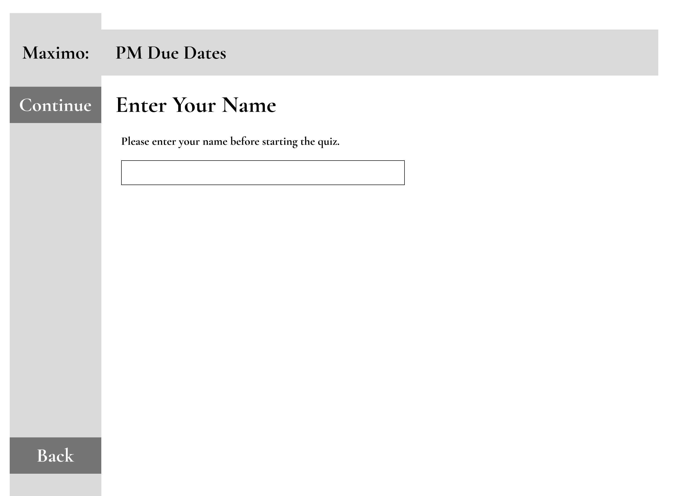

**Figure 2**: User Details frame of the Maximo PM Due Date Quiz Figma prototype.

The User Details frame (Figure 2) holds an open text field for the user's name. Once entered, clicking "Continue" proceeds to the first question (Figure 4). Clicking "Continue" with no name, or only whitespace, displays an error message instead (Figure 3). The "Back" button returns to the Landing frame (Figure 1) to review the instructions again.

##### User Details Frame - Validation Error
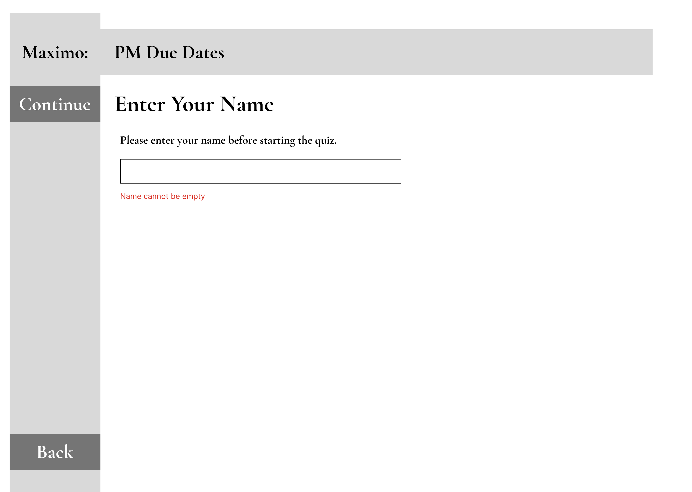

**Figure 3**: User Details frame with error of the Maximo PM Due Date Quiz Figma prototype.

##### Quiz Frame - Question One
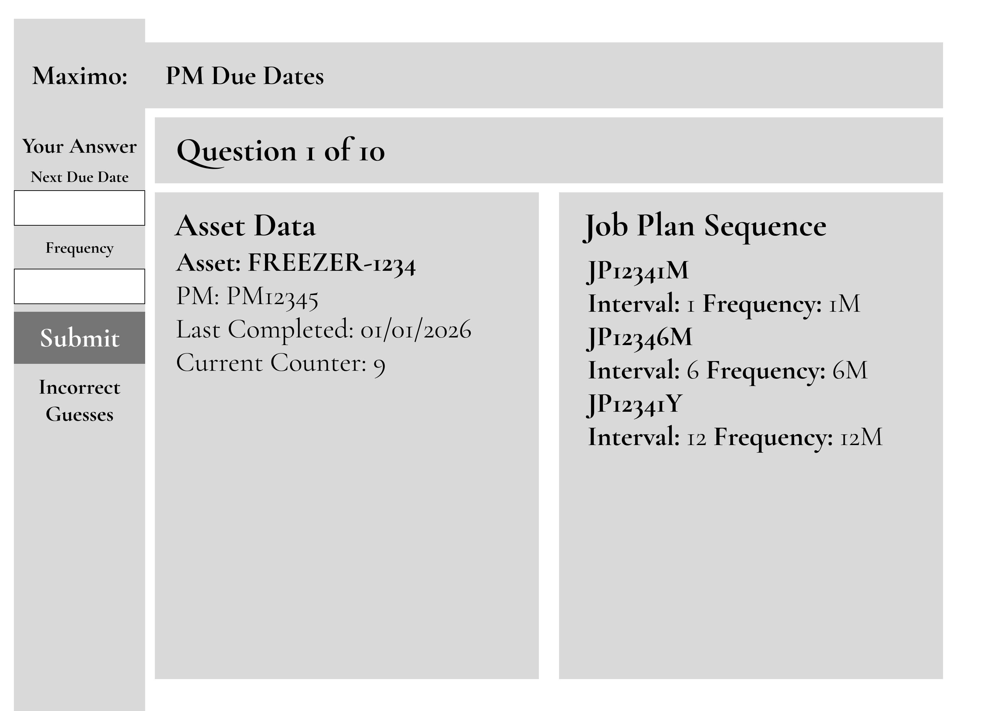

**Figure 4**: Quiz frame of the Maximo PM Due Date Quiz Figma prototype.

When a user loads the quiz frame it will generate synthetic Asset, PM and Job Plan data for the question, including a Last Completed date, Current PM Counter, and Job Plan Intervals and Frequencies. The user will take their knowledge from the introduction and use it to calculate and input a date value into the "Next Due Date" field, followed by an integer in the "Frequency" dropdown. There is only one action from this frame, but it has multiple outputs:
1. If there is an incorrect value in either field, an error will occur and display as in Figure 5.
2. If the answer is wrong, it will display below "Incorrect Guesses" (Figure 6).
3. If the answer is correct, the user will be taken to the summary timeline (Figure 7).

This is replicated ten times over, once for each randomly generated question.

##### Quiz Frame - Question One - Invalid Input
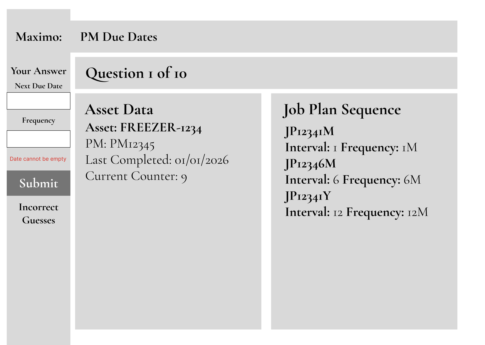

**Figure 5**: Quiz frame with invalid value of the Maximo PM Due Date Quiz Figma prototype.

##### Quiz Frame - Question One - Incorrect
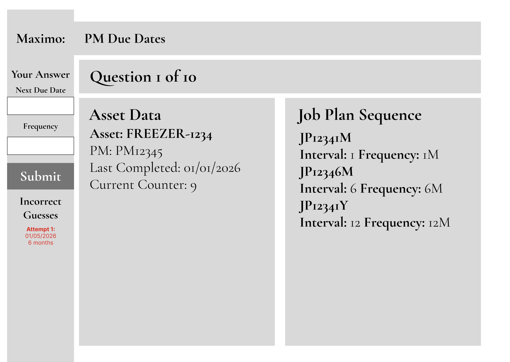

**Figure 6**: Quiz frame with incorrect guess of the Maximo PM Due Date Quiz Figma prototype.

When an input doesn't exactly match the correct date and frequency, a red set of text will appear below the "Incorrect Guesses" section of the frame, informing the user of their prior guess. The user will get three guesses in total. On a correct guess, or the third incorrect guess, they will be taken to the Timeline frame (Figure 7).

##### Quiz Frame - Question One - Correct Timeline


**Figure 7**: Timeline frame of the Maximo PM Due Date Quiz Figma prototype.

Reaching three incorrect guesses, or a single correct one, takes the user to the Timeline frame, showing their PM Job Plan timeline for the next two years. The text fields and "Submit" button grey out, and a "Next Question" button appears, leading to a new question (Figure 8).

##### Quiz Frame - Question Ten - Incorrect
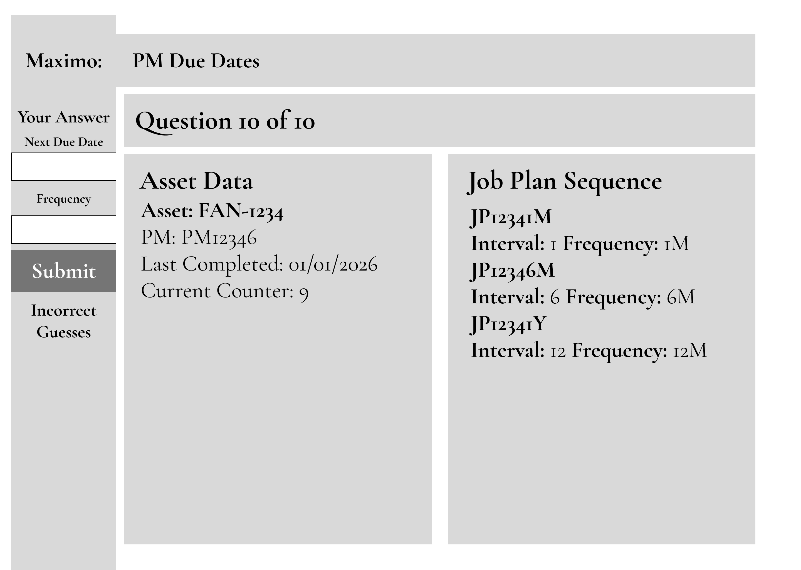

**Figure 8**: Quiz frame question ten of the Maximo PM Due Date Quiz Figma prototype.

##### Quiz Frame - Question Ten - Correct Timeline
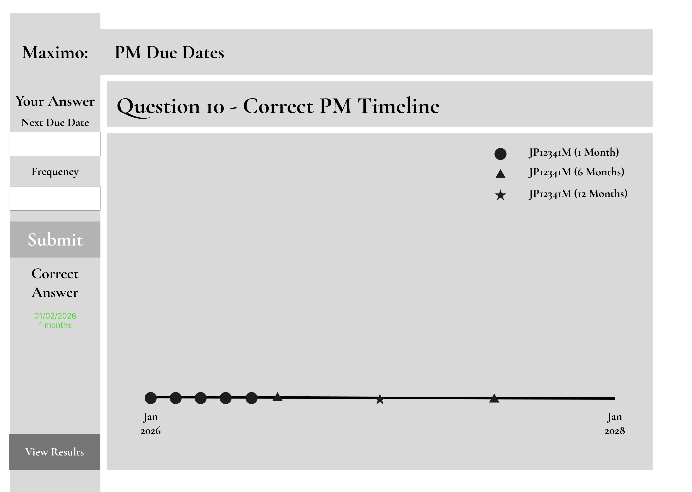

**Figure 9**: Quiz frame question ten timeline of the Maximo PM Due Date Quiz Figma prototype.

This is the only quiz frame with a different action button, on question ten's Timeline frame, "Next Question" changes to "View Results", taking the user to the Result frame instead (Figure 10).

##### Quiz Frame - Result Frame
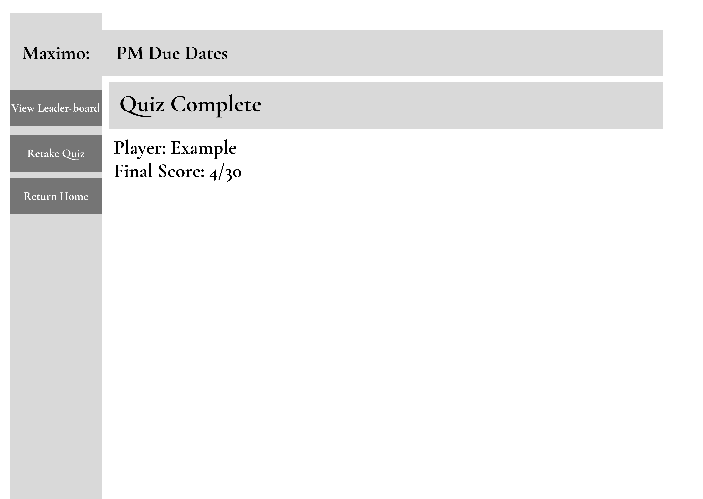

**Figure 10**: Quiz complete frame of the Maximo PM Due Date Quiz Figma prototype.

The Result frame is a simple frame that brings together some of the data stored across the quiz. Each question is worth 0-3 points, depending on how many guesses it took to answer correctly:

        1 Guess = 3 Points
        2 Guesses = 2 Points
        3 Guesses = 1 Point
        Incorrect = 0 Points

This will provide a final score out of 30 for the player, which will be displayed on their Quiz Complete frame (Figure 10).

Following this, the user has three actions:
1. View Leaderboard: Review where they placed in comparison with the other top 10 users (Figure 11).
2. Retake Quiz: This will take them back to the User Details frame (Figure 2), but will keep their current player name.
3. Return Home: This will take the player back to the Landing frame (Figure 1).

##### Quiz Frame - Leaderboard
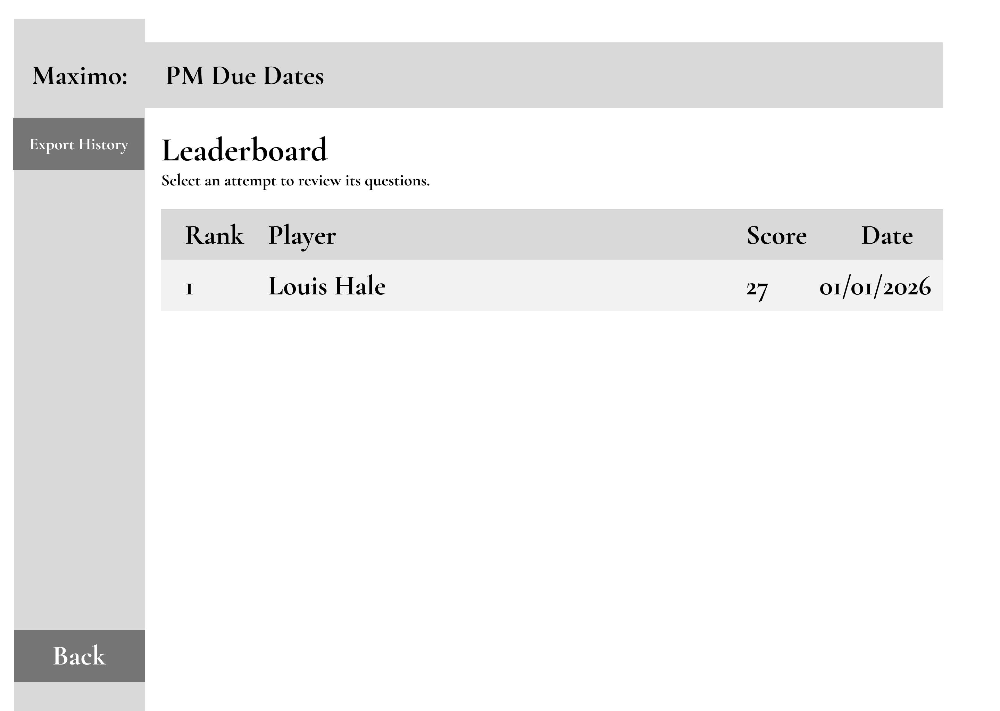

**Figure 11**: Leaderboard frame of the Maximo PM Due Date Quiz Figma prototype.

The Leaderboard frame is a table of stored user data, ranked from first to last by score and date played. It is part of a three-level Treeview, clicking an entry opens the Questions frame (Figure 12). "Export History" downloads the leaderboard with game information, and "Back" returns to the Landing frame (Figure 1).

##### Quiz Frame - Leaderboard - Questions
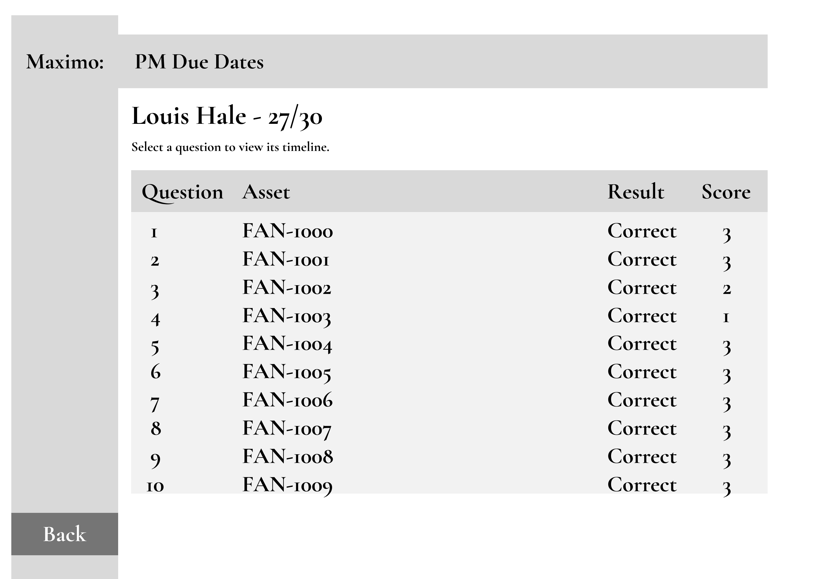

**Figure 12**: Leaderboard questions frame of the Maximo PM Due Date Quiz Figma prototype.

On the Questions frame, it will display the list of 10 questions which were asked and the score the player received for each question. This is again a Treeview which can be drilled into to review the Timeline frame (Figure 13) for that specific question. There is also a navigation button to go back to the Leaderboard frame (Figure 11).

##### Quiz Frame - Leaderboard - Questions - Timeline
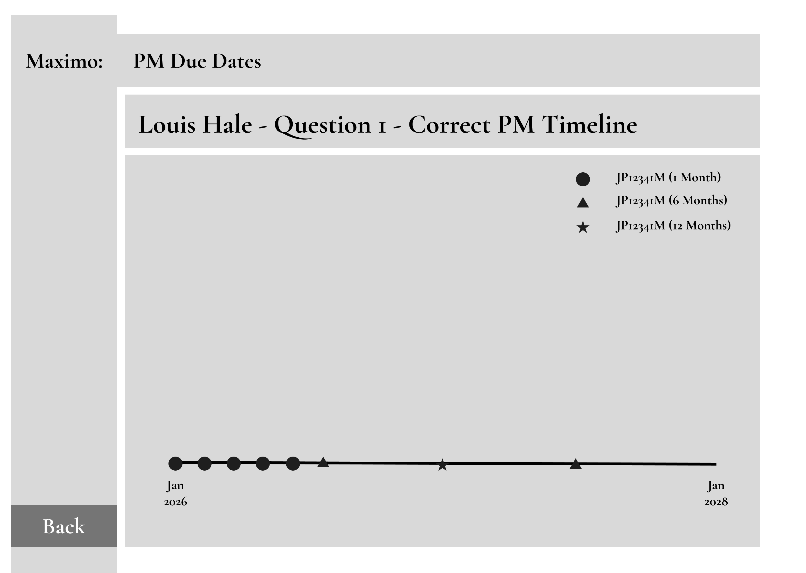

**Figure 13**: Leaderboard question timeline frame of the Maximo PM Due Date Quiz Figma prototype.

The final frame of this Treeview displays the timeline of the question selected on the prior frame (Figure 12). It takes the data from a saved CSV and displays it alongside a legend informing the user of which Job Plans and Frequencies the points relate to. The "Back" button on this frame will take the user back to the Questions frame (Figure 12) for the previously selected question.

### Functional Requirements

Table 1: Functional requirements for the Maximo PM Due Date Quiz.
| ID | Requirement |
|---|---|
| FR1 | The application must provide a landing page with options to start a new quiz or view the Leaderboard/History page. |
| FR2 | The application must require a valid name on the Player Details page before a quiz can begin, with visible feedback on invalid input. |
| FR3 | On Retake Quiz, the application must pre-fill the name field with the previous player's name, editable before the new attempt starts. |
| FR4 | The application must let the user submit a next due date and a frequency selected from the question's valid job-plan-sequence frequencies. |
| FR5 | The application must display each question's last-completed date, counter value, and defined intervals and frequencies. |
| FR6 | The application must mark an answer correct only on an exact match of frequency and due date, allow up to three attempts, and complete the question on a correct answer or after three attempts. |
| FR7 | The application must list each incorrect guess (date and frequency), kept visible until the next question begins. |
| FR8 | On question completion, the application must reveal the correct frequency, due date, and a calculated PM timeline of further occurrences. |
| FR9 | The application must score each question 3/2/1/0 points by attempt number (first, second, third, or none correct). |
| FR10 | The application must disable inputs on question completion, showing "Next Question" for questions 1-9 and "View Results" after question 10. |
| FR11 | The Results page must show the player's name and score, with "View Leaderboard", "Retake Quiz", and "Return Home" actions. |
| FR12 | The application must display the top 10 stored attempts by score on the Leaderboard/History page, ties broken by recency. |
| FR13 | The user must be able to select an attempt and a question from the Leaderboard to view its timeline, replacing any timeline shown. |
| FR14 | The application must provide an "Export History" action to export the full attempt summary history to a chosen location. |
| FR15 | The application must validate the due date before evaluating the answer, invalid input shows feedback and does not count as an attempt. |
| FR16 | Each attempt must consist of exactly 10 questions, ending at Results after the tenth. |
| FR17 | The application must catch read, write, and export errors without crashing, showing clear feedback and never falsely indicating success. |

### Non-Functional Requirements

Table 2: Non-Functional requirements for the Maximo PM Due Date Quiz.
| ID | Requirement |
|---|---|
| NFR1 | With up to 100 stored attempts, user actions (answering, advancing, loading the Leaderboard, exporting) must respond within 1 second. |
| NFR2 | At a 1440x1024 window size, all primary controls must be usable without resizing, including all Quiz page elements at once. |
| NFR3 | Body text must be at least 11pt with a 4.5:1 contrast ratio, and colour-coded states must also use a non-colour cue. |
| NFR4 | On a clean setup following the README instructions, the application must launch to the Landing page within 3 seconds with no pre-existing CSV files required. |

### Tech Stack

Table 3: Tech stack used in the Maximo PM Due Date Quiz.

| Component | Choice | Why |
|---|---|---|
| Language | Python 3.12 | Brief has a Python 3.9+ minimum, and the newer version let me use structural pattern matching (`match`/`case`) for the scoring logic instead of a chain of if/elif statements. |
| GUI framework | Tkinter, with `ttk` for the themed widgets | Studied in the course, and it needed nothing to host or deploy which benefits MACS EU for more available usage. |
| Data visualisation | Matplotlib | Draws the PM timeline straight inside the Tkinter window, no need to leave the app to see the result. |
| Synthetic data generation | NumPy | Studied in course and generates the randomised asset, PM and job-plan-sequence data behind each question. |
| Persistent storage | CSV | As using a desktop app can meets the storage requirement without a database, and can use mutliple files with key ids for relationships. |
| Automated testing | `unittest` | Comes with Python, no extra dependency for CI to manage, and it's what the course teaches. |
| Continuous integration | GitHub Actions | Runs the test suite on every push and pull from GitHub |
| Prototyping | Figma | Used to build GUI Prototype, evidenced earlier in design. |

### Code Design

The application is built around three classes: `QuizApp`, `Attempt`, and `Question`. I kept this small, following prior advice not to overcomplicate the design. `QuizApp` inherits from `tk.Tk`. Everything else is built through composition instead. `Attempt` and `Question` are plain dataclasses holding data only, with no behaviour of their own. The scoring, timeline, and due-date logic all live separately in `pm_logic.py`, so that logic can be unit tested without needing the GUI. The relationship between the three classes is shown below in Figure 14.

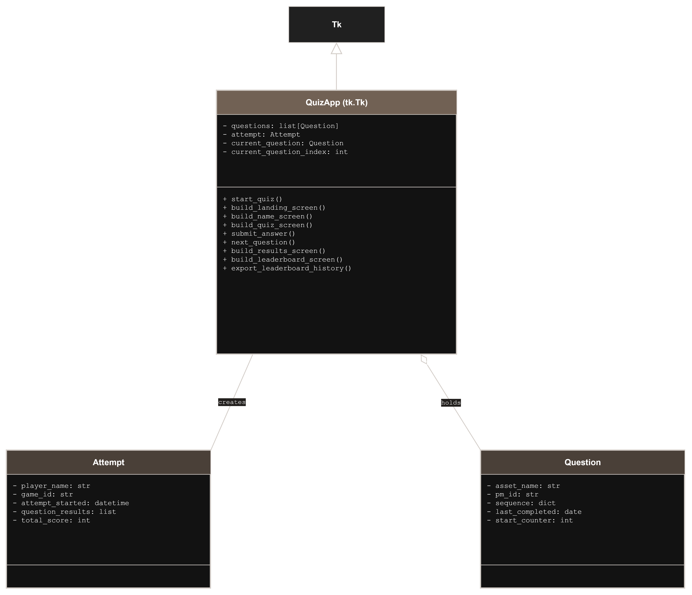

**Figure 14**: Class diagram of the Maximo PM Due Date Quiz, showing QuizApp, Attempt, and Question.

## Development

For my development I kept the GUI as simplistic as possible, anything which needs to be checked for correctness sits in a pure function separate.
This is divided up as below:

`main.py` - Handles the `QuizApp` GUI, which manages the display and wiring events to other modules.

`pm_logic.py` - This is a purely calculation logic for due dates, timelines and scoring.

`validators.py` - Runs validation against inputs, runs before inputs get ran through pure logic.

`question_bank.py` - Used for synthetic data generation.

`storage.py` - Reads and writes all the CSV files.

An example of this pure function seperation is `score_for_attempt` in `pm_logic.py`, which converts the attempt number into a score with no alterations on the input data.
I also used a match/case as I find it cleaner and less repetitive than an else/if chain.
With the same input it will always return the same output.

```
def score_for_attempt(attempt_number, correct):
    if correct:
        match attempt_number:
            case 3:
                return 1
            case 2:
                return 2
            case 1:
                return 3
            case _:
                return 0
    return 0
```

The validation in `validators.py` all follow the same style throughout. I implemented it so `validate_frequency` returns a flag and a message, then the GUI can parse that message and display it for the user directly on the screen.

```
def validate_frequency(frequency_text, valid):
    if not frequency_text:
        return False, "Frequency cannot be empty"

    try:
        frequency = int(frequency_text)
    except ValueError:
        return False, "Frequency must be a whole number"

    if frequency not in valid:
        return False, "Frequency is not valid"

    return True, ""
```

Whilst in the storage, `load_results` is used to return empty lists and stop crashing, so that any issues inside of the rows can be skipped without causing issues with the rest.

```
def load_results():
    try:
        with open(RESULTS_FILE, mode="r", newline="") as file:
            reader = csv.DictReader(file)

            results = []

            for row in reader:
                try:
                    row["total_score"] = int(row["total_score"])
                    row["attempt_started"] = datetime.fromisoformat(row["attempt_started"])
                except (KeyError, TypeError, ValueError) as error:
                    print(f"Skipping corrupted row in {RESULTS_FILE}: {error}")
                    continue

                results.append(row)

            return results

    except FileNotFoundError:
        return []
```

These three functions stand to prove that the applications core logic is predicatable, holds validation and withstand errors.
`score_for_attempt` and `validate_frequency` will always return the same results given the same input whilst `load_results` has failsafes to avoid bad rows.
Then applying this logic outside of the GUI enables it to the testable as displayed next.

## Testing

### Testing Strategy and Methodology

For testing I focused on unit testing the pure functions, since they don't need the GUI running to test. Manual testing covers the parts that do.

### Unit Testing Outcomes

Before we looked at `score_for_attempt` which is tested against all three successful attempt numbers plus a failure, to prove the whole scoring rule is covered, not just one path through it.

```
def test_score_for_attempt_success_attempt_1(self):
    self.assertEqual(score_for_attempt(1, True), 3)

def test_score_for_attempt_success_attempt_2(self):
    self.assertEqual(score_for_attempt(2, True), 2)

def test_score_for_attempt_success_attempt_3(self):
    self.assertEqual(score_for_attempt(3, True), 1)

def test_score_for_attempt_fail(self):
    self.assertEqual(score_for_attempt(3, False), 0)
```

`validate_frequency` a good display of testing each valid case and the specific outputs including the message, not just pass and fail.

```
def test_validate_frequency_valid(self):
    self.assertEqual(
        validate_frequency(6, [1, 2, 3, 6, 12, 24, 60]),
        (True, "")
    )

def test_validate_frequency_invalid(self):
    self.assertEqual(
        validate_frequency(5, [1, 2, 3, 6, 12, 24, 60]),
        (False, "Frequency is not valid")
    )

def test_validate_frequency_not_a_number(self):
    self.assertEqual(
        validate_frequency("abc", [1, 2, 3, 6, 12, 24, 60]),
        (False, "Frequency must be a whole number")
    )

def test_validate_frequency_empty(self):
    self.assertEqual(
        validate_frequency("", [1, 2, 3, 6, 12, 24, 60]),
        (False, "Frequency cannot be empty")
    )
```

This final test is a check of corruption, writing a single good row before two corrupted rows into the CSV, then makes sure the `load_results` only pulls the correct one back.
```
def test_load_results_skips_corrupted_row(self):
    with open(storage.RESULTS_FILE, "w", newline="") as file:
        file.write("game_id,player_name,total_score,attempt_started\n")
        file.write("good1,Good Player,10,2026-01-01T09:30:00\n")
        file.write("bad1,Bad Player,not-a-number,2026-01-01T09:30:00\n")
        file.write("bad2,Bad Player,10,not-a-date\n")

    results = load_results()

    self.assertEqual(len(results), 1)
    self.assertEqual(results[0]["game_id"], "good1")
```

### Continuous Integration

CI runs the same set of unit tests for every push and pull from GitHub, automatically through GitHub Actions. `.github/workflows/tests.yml` is used ot define the test that are run through powershell commands.

```
name: Run unit tests

on:
  push:
    branches: [ "main" ]
  pull_request:
    branches: [ "main" ]

jobs:
  tests:
    runs-on: ubuntu-latest
    steps:
    - uses: actions/checkout@v6
    - name: Set up Python 3.12
      uses: actions/setup-python@v6
      with:
        python-version: "3.12"
    - name: Install dependencies
      run: pip install -r requirements.txt
    - name: Run unit tests
      run: python -m unittest discover -s tests -v
```

This runs tests in a clean Ubuntu environment with only the `requirements.txt` installed. This is great for TDD as we can write failing tests that we can then push fixes for later.

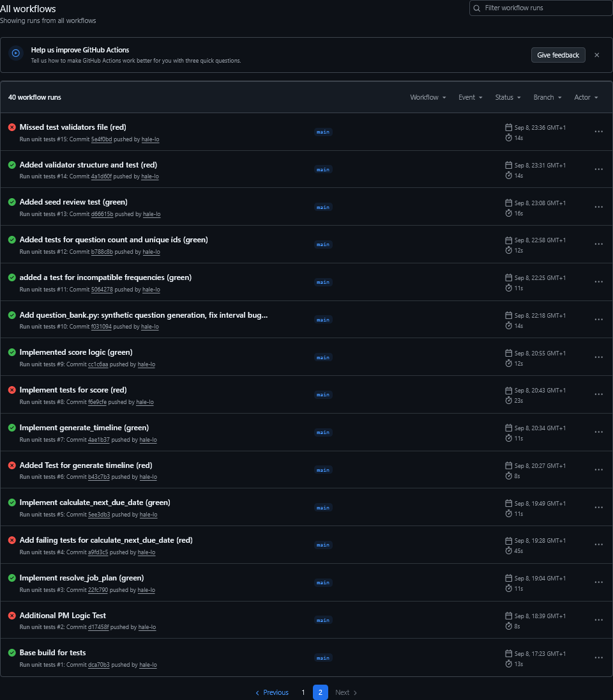

**Figure 15**: GitHub Actions run of the test suite for the Maximo PM Due Date Quiz.

### Manual Testing Outcomes

Table 4: Manual testing outcomes for the Maximo PM Due Date Quiz.

| ID | Requirement | Steps | Input | Expected Result | Pass/Fail |
|---|---|---|---|---|---|
| MT1 | FR1 | Launch the app, view Landing frame |  | Two options shown: start a new quiz, view Leaderboard | Pass |
| MT2 | FR2 | Leave name blank on User Details, click Continue | **NULL** | Error message displays, does not proceed | Pass |
| MT3 | FR2 | Enter only spaces as name, click Continue | "   " | Error message displays, does not proceed | Pass |
| MT4 | FR3 | Complete a quiz, click Retake Quiz |  | User Details frame shows previous player's name, pre-filled and editable | Pass |
| MT5 | FR6 | Submit an exactly correct due date and frequency | Correct values | Question marked correct, taken to Timeline frame | Pass |
| MT6 | FR6 | Submit an incorrect answer three times | Three wrong values | Question completes after 3rd attempt, marked incorrect | Pass |
| MT7 | FR7 | Submit two incorrect guesses in a row | Two wrong values | Both incorrect guesses listed and stay visible | Pass |
| MT8 | FR8 | Complete a question (correct or after 3 attempts) |  | Correct frequency, due date, and PM timeline revealed | Pass |
| MT9 | FR10 | Reach question 10's Timeline frame |  | Button reads "View Results" instead of "Next Question" | Pass |
| MT10 | FR11 | Reach Results frame |  | Player name and score shown, with View Leaderboard, Retake Quiz, Return Home | Pass |
| MT11 | FR12 | Open Leaderboard with 10+ stored attempts |  | Top 10 shown by score, ties broken by recency | Pass |
| MT12 | FR13 | Click an attempt, then a question, on the Leaderboard |  | Drills into that question's Timeline frame | Pass |
| MT13 | FR14 | Click Export History |  | Attempt summary history exported to chosen location | Pass |
| MT14 | NFR2 | Resize window to 1440x1024 |  | All primary controls usable without resizing | Pass |
| MT15 | NFR4 | Launch app on a clean setup with no existing CSVs |  | Loads to Landing page within 3 seconds, no errors | Pass |

## Documentation

### User Documentation
Open the quiz. From the Landing frame, choose "Start Quiz" to begin, or "View Leaderboard" to see previous results (Figure 1).

Enter your name. Type your name and click "Continue". If the field is left blank, an error message will ask you to enter a name before continuing (Figures 2–3).

Answer each question. Using the Asset, PM and Job Plan details shown on screen, enter the next due date and select the frequency, then click "Submit" (Figure 4). You have three attempts per question, each incorrect guess is listed on screen (Figure 6). Once you answer correctly, or use all three attempts, the correct answer and a timeline are revealed (Figure 7).

Move to the next question. Click "Next Question" to continue, this repeats for all ten questions. On the tenth question, this button becomes "View Results" instead (Figure 9).

View your results. Your score out of 30 is shown, along with three options: "View Leaderboard," "Retake Quiz," or "Return Home" (Figure 10).

Check the Leaderboard. The top 10 scores are listed here. Click a name to see that attempt's answers, and click a question to see its timeline (Figures 11–13). Use "Export History" to save a copy of the full results, or "Back" to return home.

### Technical Documentation

This application requires Python 3.12 or above.

To run it locally:

```
git clone https://github.com/hale-lo/maximo-pm-due-dates-quiz
cd maximo-pm-due-dates-quiz
pip install -r requirements.txt
python main.py
```

To run the test suite locally, the same way CI runs it:

python -m unittest discover -s tests -v

For anyone maintaining this codebase, main.py holds the QuizApp GUI and is the entry point, while pm_logic.py, validators.py, question_bank.py and storage.py hold the logic behind it, each explained in the Development section above.

## Evaluation

Generally the design plan went well. I matched my Figma prototype almost exactly, which let me write the GUI code faster for each screen since I already knew where everything was meant to go, giving me a code structure to start from. My own prior experience also helped with the code design, I was able to look back at previous work and base fixes and functions around it.

What went poorly was the choice of Tkinter. It has benefits long term, but the application ended up looking rough. I could have spent more time on a firm colour scheme before building, so a Hi-Fi design after my sketch might have worked better. A web application would probably have allowed for a more specific design style, and been more satisfying for the user.

Nothing strayed too far from the plan during development. I did have to build more workarounds than I'd like to keep it in line with it, and I implemented OOP later than I should have, since I was writing code freely rather than following the design I'd set out.

I didn't leave anything out of the required features, but the biggest limitation is that it feels static, I'd like it to be more interactive for the user. One thing I wanted to add was showing a player's incorrect guesses on the timeline as well, to help them see where they went wrong, but that came down to time, and keeping the MVP clean took priority.

If I kept working on this, I'd use it as a base and put a lot more effort into the overall design and how it feels to use, maybe adding sound and making the application more responsive.